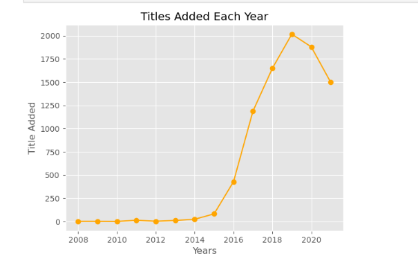
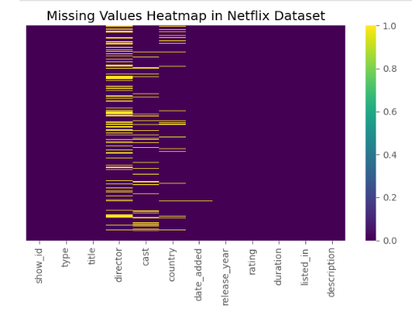
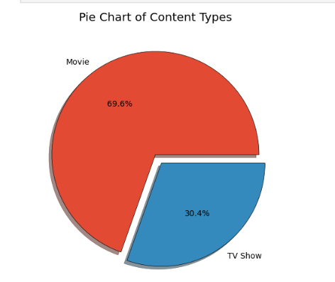
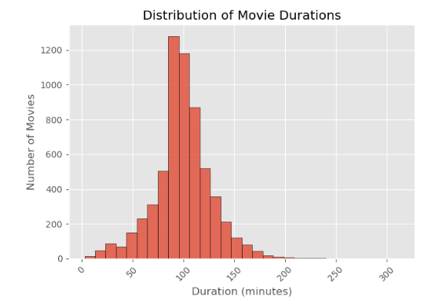
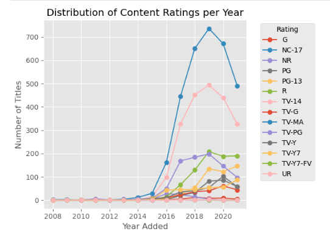

# Netflix Dataset Analysis & Visualization 📺📊

This project explores and visualizes the Netflix Titles Dataset using **Pandas** and **Matplotlib** in a Jupyter Notebook. It includes data cleaning, missing value treatment, and various visualizations to uncover trends and insights about Netflix's global content.

---

## 🔍 Features

- Handling missing values and inconsistent entries
- Visualizations:
  - Line plot of titles added each year
  - Heatmap of missing data
  - Pie chart of content types
  - Histogram of movie durations
  - Line plot of rating trends by year
- Duration extraction and transformation
- Cleaned and structured dataset for analysis

---

## 📁 Dataset

Netflix Titles Dataset from [Kaggle](https://www.kaggle.com/datasets/shivamb/netflix-shows)

---

## 📊 Sample Visualizations

### 📈 Titles Added Each Year


### 🔥 Missing Values Heatmap


### 🥧 Content Type Distribution


### 🎬 Movie Duration Distribution


### 🎯 Ratings Over Time



---

## 🚀 How to Run

1. Clone this repo
2. Open `Netflix_Dataset_Analysis.ipynb` in Jupyter
3. Install dependencies:
   ```bash
   pip install pandas matplotlib seaborn
