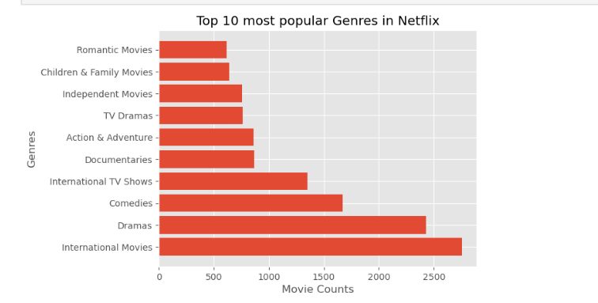

# Netflix Dataset Analysis & Visualization 📺📊

This project explores and visualizes the Netflix Titles Dataset using **Pandas** and **Matplotlib** in a Jupyter Notebook. It includes data cleaning, missing value handling, and a variety of insightful visualizations to uncover trends in Netflix content.

---

## 🔍 Features

- Missing value treatment and data cleaning
- Extracted and standardized date and duration fields
- Visualizations:
  - Titles added per year
  - Heatmap of missing data
  - Content type proportions
  - Movie duration distribution
  - Ratings trend over the years
  - Most popular genres

---

## 📁 Dataset

Netflix Titles Dataset from [Kaggle](https://www.kaggle.com/datasets/shivamb/netflix-shows)

---

## 📊 Sample Visualizations

### 📈 Titles Added Each Year


### 🔥 Missing Values Heatmap


### 🥧 Content Type Distribution


### 🎬 Movie Duration Distribution


### 🎯 Ratings Trend Over Time


### 🎭 Most Popular Genres


---

## 🚀 How to Run

1. Clone this repository
2. Open `Netflix_Dataset_Analysis.ipynb` in Jupyter Notebook
3. Install dependencies:
   ```bash
   pip install pandas matplotlib seaborn

